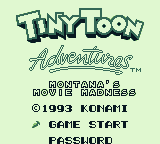
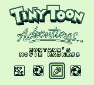
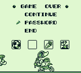
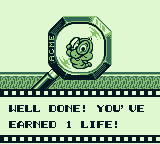

# Tiny Toon Adventures 2 - Montana's Movie Madness Restoration Mod
ASM sourcecode for Game Boy Tiny Toon Adventures 2 (USA/Europe) restoration mod. The aim of this project is to restore some features the Japanese version had:

- password function
- unlimited continues
- earn an extra life after winning a minigame
- earn an extra life after reaching 2000 points (instead of 3000)

Making the game more enjoyable and less frustrating.

Read more about the regional differences at [The Cutting Room Floor](https://tcrf.net/Tiny_Toon_Adventures_2:_Montana%27s_Movie_Madness#Regional_Differences).

## Author's note
Tiny Toon 2 for the Game Boy is one of my childhood games... that, sadly, I was never able to finish. It had no passwords nor unlimited continues, making it really unfair in a couple of stages. It is a shame because it's quite a good game (and usually forgotten too).

Years later, I found out that the Japanese version was much more balanced thanks to the addition of the password feature and other smaller tweaks.

And more years later, I learned about a [Tiny Toon SNES restoration hack](https://www.timeextension.com/features/best-of-2024-konami-butchered-this-snes-classic-so-we-fixed-it) that restored the password functionality. Guess who got inspired to try to do the same to his beloved Game Boy game.

That SNES game still had the password feature coded in. However, Tiny Toon 2 for the Game Boy didn't, so everything had to be ported back from the Japanese game.

It sounded easy at first, but due to how the Game Boy ROM banks work, there wasn't enough space. So I decided to just translate the Japanese game into English, which sounded easier too, but...

The English texts were much longer than the Japanese ones, so they didn't fit unless I doubled the ROM size. But **I love challenges**! So I finally went for the hardest route: restoring the password feature in the English ROM while keeping the game size below the original 128kb.

Long story short: I achieved it. But it was hard as hell. The free space is quite limited and I had to rearrange things and do heavy optimizations to the original code to save some space and make room for the new code.

So here it is: a hack nobody asked for, but that I am proud of ^_^ 
Enjoy this cute lil platformer in English and with passwords!

## How to compile
1. Download [RGBDS](https://github.com/rednex/rgbds/) and extract it into the `rgbds` folder
2. Place Tiny Toon Adventures 2 - Montana's Movie Madness (USA, Europe) ROM (CRC32: `c5c7868d`) in the roms folder and rename it to `tiny_toon_2_en.gb`
3. Run `assemble.bat` (Windows) or `assemble.sh` (Unix); it will create `tiny_toon_2_en_restored.gb`
